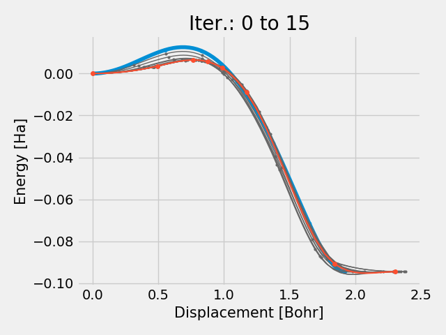
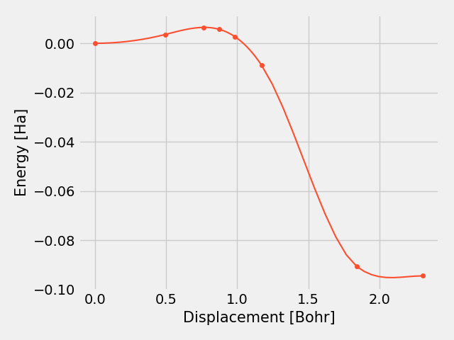

# neb_visualize
script to visualize results from an ORCA-NEB run for ORCA 4.2

Usage: `python neb_snapshots.py [orca.interp] [start iter] [end iter]`

**orca.interp**	name of the .interp file outputted from an ORCA NEB run (default: orca.interp)

**start iter**	integer value for the number of iteration where the script should start plotting (default: 0)

**end iter** 	integer value for the number of iteration where the script should stop plotting  (default: -1 (last iter.))

## Changes by Andrew
* display of plots (see below) and where files go (to the same directory):

</a> </a>

NEB snapshot plots for the CH3Cl  + F- --> Cl- + CH3F reaction IRC path calculated using orca (https://sites.google.com/site/orcainputlibrary/geometry-optimizations/transition-state-optimizations)

* printing of local energy barriers in terminal (i.e. 0.002 Hartrees @ 1.1 Bohrs; 0.004 Hartrees @ 1.4 Bohrs)
